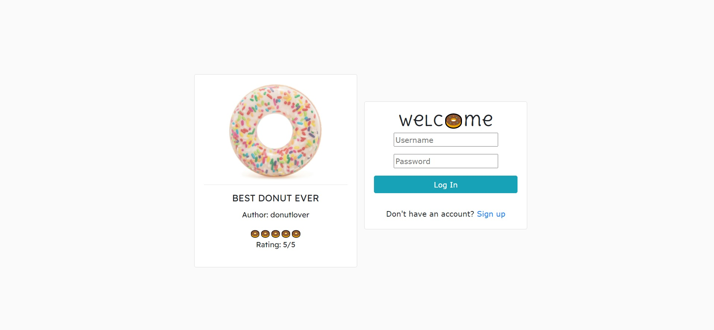
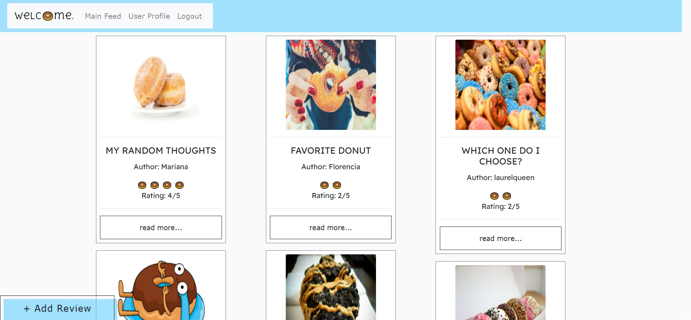
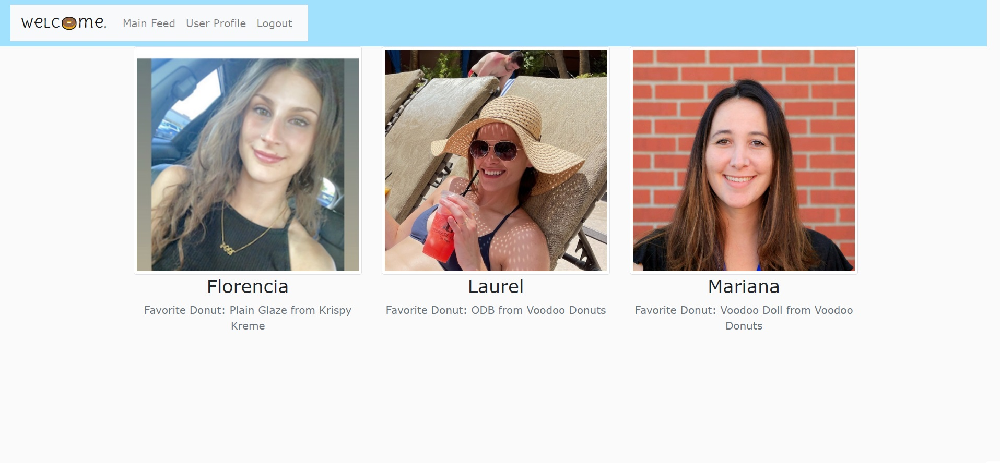

# DONUT-FORGET-TO-REVIEW

<a name="descsection"></a>
## Description
We 💗 donuts and we 💗 reviews, so why not combine the two?! The purpose of this site is to allow users to upload photos of their donut adventures, along with reviewing their findings. Users are able to comment on other people's posts in order to provide their insight and share in the donut loving journey.

Our site uses handlebars, nodeJS, multer, cloudinary and more in order to provide a seamless user experience.  The user is prompted to login or create an account in order to access posts and interact with the site.

We loved creating this site and we hope you love your time eating and reviewing donuts. Donut wait, go get yourself a donut now!

[](https://opensource.org/licenses/MIT)


## Table of Contents
1. [ Description. ](#descsection)
2. [ Installation. ](#installsection)
3. [ Usage. ](#usagesection)
4. [ License. ](#licensesection)
5. [ Contributing. ](#contribsection)
6. [ Tests. ](#testsection)
7. [ Questions. ](#questionssection)
8. [ Screenshots. ](#picsection)
9. [ Links. ](#linksection)
10. [ Resources/Credit. ](#creditsection)

<a name="installsection"></a>
## Installation
* Clone the repository using:
```
git clone https://github.com/laurelthorburn/DONUT-FORGET-TO-REVIEW.git
```
* Ensure you are in the current working directory
* Open terminal in working directory and type:
```
npm init
```
* Install dependencies (bcrypt, cloudinary, connect-session-sequelize, dotenv, express, express-handlebars, express-session, mysql2, multer and sequelize) by opening the terminal (ctrl + j on windows) and running:
```
npm install
```
OR each of the following:
```
npm install bcrypt || npm install cloudinary || npm install connect-session-sequelize ||  npm install dotenv || npm install express || npm install express-handlebars || npm install express-session || npm install mysql2 || npm install multer || npm install sequelize
```

<a name="usagesection"></a>
## Usage
*  After following user installation guide above, open the database (db) folder in the integrated terminal and log onto mysql:
```
mysql -u root -p
```
* Enter mysql password and then SOURCE the schema file
```
SOURCE schema.sql
```
* Open root folder in the integrated terminal and type in the following order:
```
npm run seed
npm run dev (only works if nodemon is installed)
```
* Open your localhost:3001 
* Enjoy!

<a name="licensesection"></a>
## License
Copyright <2021>

Permission is hereby granted, free of charge, to any person obtaining a copy of this software and associated documentation files (the "Software"), to deal in the Software without restriction, including without limitation the rights to use, copy, modify, merge, publish, distribute, sublicense, and/or sell copies of the Software, and to permit persons to whom the Software is furnished to do so, subject to the following conditions:

The above copyright notice and this permission notice shall be included in all copies or substantial portions of the Software.

THE SOFTWARE IS PROVIDED "AS IS", WITHOUT WARRANTY OF ANY KIND, EXPRESS OR IMPLIED, INCLUDING BUT NOT LIMITED TO THE WARRANTIES OF MERCHANTABILITY, FITNESS FOR A PARTICULAR PURPOSE AND NONINFRINGEMENT. IN NO EVENT SHALL THE AUTHORS OR COPYRIGHT HOLDERS BE LIABLE FOR ANY CLAIM, DAMAGES OR OTHER LIABILITY, WHETHER IN AN ACTION OF CONTRACT, TORT OR OTHERWISE, ARISING FROM, OUT OF OR IN CONNECTION WITH THE SOFTWARE OR THE USE OR OTHER DEALINGS IN THE SOFTWARE.

  <a name="contribsection"></a>
## Contributing
  
1. [Fork the repo!](https://docs.github.com/en/get-started/quickstart/fork-a-repo)
2. Create a feature branch:
```
git checkout -b your-branch-name-here
```
3. Commit changes:
```
git commit -m 'Your changes here'
```
4. Push to the branch:
```
git push origin yourname-branch
```
5. Submit a pull request and wait for it to be approved or denied.

  <a name="testsection"></a>
## Tests
  No tests are available at this time.

  <a name="questionssection"></a>
## Questions?

  Questions/comments/concerns? Please send an email to:
  * Laurel: codinglaurel@gmail.com || [GitHub](https://github.com/laurelthorburn)
  * Mariana: marianahodniki1991@gmail.com || [GitHub](https://github.com/mhdavie)
  * Florencia: florenciawebdev@gmail.com || [GitHub](https://github.com/FlorenciaB94)

  <a name="picsection"></a>
  ## Screenshots
  
  
  

  <a name="linksection"></a>
  ## Links
  
  Deployed Heroku Site: https://donut-forget-to-review.herokuapp.com/

  Github Site: https://github.com/laurelthorburn/DONUT-FORGET-TO-REVIEW

Resources/Credit
* https://cloudinary.com/
* https://medium.com/wdstack/bootstrap-4-vertical-center-1211448a2eff
* https://stackoverflow.com/questions/35133573/import-external-file-content-into-handlebar
* https://stackoverflow.com/questions/43461718/bootstrap-4-center-just-two-cards-not-three-just-two
* https://stackoverflow.com/questions/64906432/has-the-user-liked-the-post-before-or-not-using-sequelize
* https://www.w3schools.com/howto/tryit.asp?filename=tryhow_js_slideshow_auto
* https://stackoverflow.com/questions/18739937/how-to-keep-footer-at-bottom-of-screen
* https://getcssscan.com/css-buttons-examples
* https://www.w3schools.com/howto/howto_js_rangeslider.asp
* https://stackoverflow.com/questions/53280738/join-in-sequelize
* https://github.com/samuelfox1/cloudinary-sandbox
* https://dev.to/alvarosaburido/use-custom-emoji-as-a-cursor-using-css-3j7
* https://codepen.io/joebocock/pen/ZEWoMPb
* https://www.npmjs.com/package/multer
* https://medium.com/@joeokpus/uploading-images-to-cloudinary-using-multer-and-expressjs-f0b9a4e14c54
* https://stackoverflow.com/questions/13645084/access-a-variable-outside-the-scope-of-a-handlebars-js-each-loop
